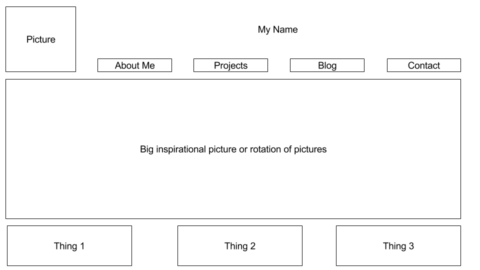

What is a wireframe?

A wireframe is a visual layout of your site that doesn't have any content in it. It is meant to give you an idea of the direction you're taking the site visually before you begin to code.

What are the benefits of wireframing?

It gives you time to visualize the site without worrying about details of what you're filling it with.

Did you enjoy wireframing your site?

I found it stressful, design is not my strong point.

Did you revise your wireframe or stick with your first idea?

I already tried to make a website for myself once, so I tried to wireframe based on that.  I had to stop and start a few times though.

What questions did you ask during this challenge? What resources did you find to help you answer them?

I wondered if it was necessary to use the actual wireframing tools or if I was capable of doing it with something I had available to me.  I used Google Sheets, it worked OK but it doesn't leave much room vertically.

Which parts of the challenge did you enjoy and which parts did you find tedious?

I enjoyed picturing my blog, but I did not enjoy trying to translate it to "paper". I wanted to go look for examples, but in a previous exercise an author recommended against looking for inspiration in other sites because you'll end up copying them. So I tried to make it unique which was hard.