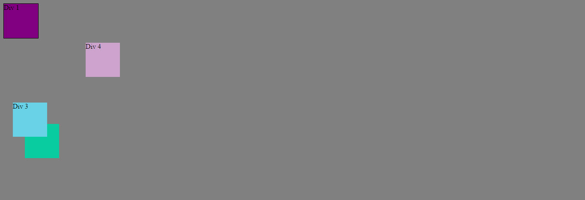
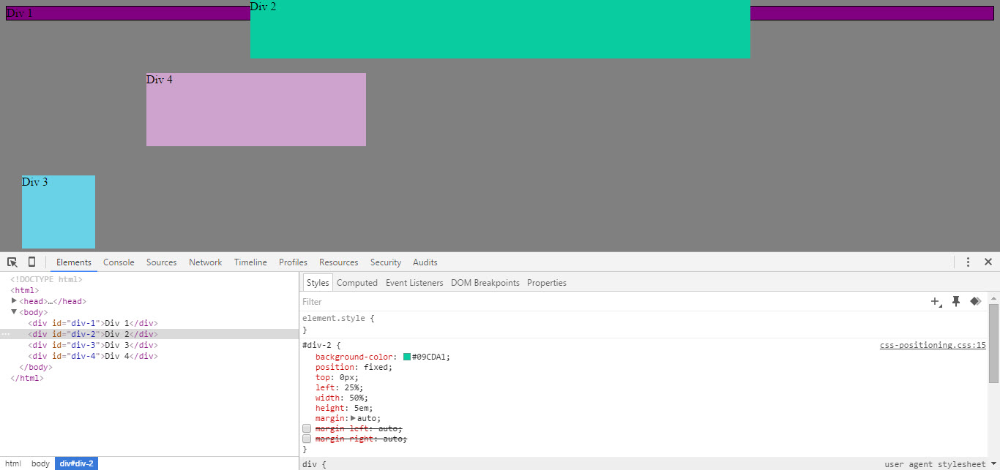

How can you use Chrome's DevTools inspector to help you format or position elements?

It is much easier to try to experiment and reposition live and without editting your actual CSS than it is to try and edit and save and reload each time.

How can you resize elements on the DOM using CSS?

By setting the width and the height properties.

What are the differences between absolute, fixed, static, and relative positioning? Which did you find easiest to use? Which was most difficult?

Absolute positions relative to ancestor elements, fixed positions relative to the viewport, static is the default, and relative is just static but shifted how you tell it.

Static is the most difficult because things seem to go where they want. Since you can't really see the margins.

Fixed was easiest for me because you just tell it where to go on the page.

What are the differences between margin, border, and padding?

In the box model, padding is directly around the element, and includes the background. Border goes around the padding, and margin is the distance between the border and the edge of the element.

What was your impression of this challenge overall? (love, hate, and why?)

I loved this challenge and I wish I did it earlier in the week so I could use what I learned in the solo challenge!

