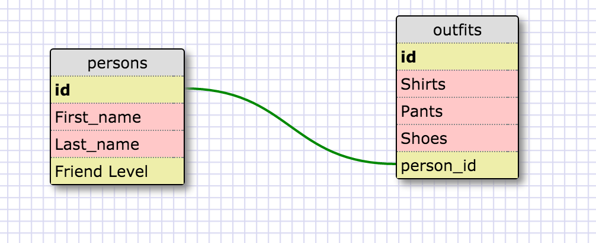

SELECT * FROM states;

SELECT * FROM regions;

SELECT state_name, population FROM states;

SELECT state_name, population FROM states
ORDER BY population DESC;

SELECT state_name FROM states WHERE region_id=7;

SELECT state_name, population_density FROM states 
WHERE population_density>50 
ORDER BY population_density;

SELECT state_name FROM states 
WHERE population BETWEEN 1000000 AND 1500000;

SELECT state_name, region_id FROM states ORDER BY region_id;

SELECT region_name FROM regions WHERE region_name LIKE '%Central';

SELECT regions.region_name, states.state_name FROM regions
INNER JOIN states
ON regions.id=states.region_id;

REFLECTION:
What are databases for?

Databases are for storing large amounts of complicated but related data.

What is a one-to-many relationship?

A one-to-many relationship refers to how a key in one table is related to multiple different items in a separate table.

What is a primary key? What is a foreign key? How can you determine which is which?

A primary key is a unique identifier in a given table. A foreign key is an identifier in a table which is tied to the primary key in another table. Foreign keys can be repeated for different selections but a primary key has to be unique to each entry.

How can you select information out of a SQL database? What are some general guidelines for that?

SELECT column FROM tableName is the basic function for retrieving data. You can then add conditions or select from multiple tables.